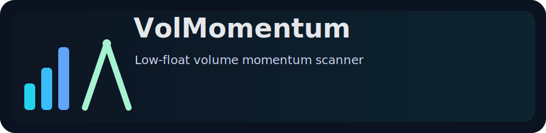

# VolMomentum
Low-float volume momentum scanner. A small tool I made for fun to spot unusual volume moves.

## Download
- Open the Releases page and download `volmomentum.exe`.
- Put the exe anywhere on your PATH, or run it from the folder you downloaded.

## Get your free API keys (2 minutes)
This tool needs two free API keys: one from Polygon and one from Financial Modeling Prep (FMP).

1) Polygon (market snapshots)
- Go to Polygon (https://polygon.io/pricing) and click **Get started for free**.
- Create an account and log in.
- Open your **Dashboard** and copy your API key.

2) FMP (float data)
- Go to Financial Modeling Prep (https://site.financialmodelingprep.com/pricing-plans) and click **Get Started** on the Free plan.
- Create an account and log in.
- Copy your API key from your account/dashboard page.

## Quick start
1) Create a `.env` file next to the exe (or set environment variables):

```
POLYGON_API_KEY=your_polygon_key
FMP_API_KEY=your_fmp_key
```

2) Run the scanner:

```
volmomentum --min-vol-ratio 2.0 --float-max 20000000 --max-results 50
```

## How it works (high level)
- Pulls float data from Financial Modeling Prep (or a local float CSV you supply).
- Pulls current-day and previous-day volumes from Polygon snapshots.
- Filters for low-float tickers and ranks by volume ratio.

## Use cases
- Get a quick list of low-float tickers with unusual volume.
- Spot symbols that might be breaking out on volume.
- Build a watchlist for deeper research.

## Options you might care about
```
volmomentum --help
```

Common flags:
- `--float-max` limit by float size (default 20,000,000)
- `--min-vol-ratio` compare today vs previous day (default 2.0)
- `--min-price-change` filter by percent move (default 0.0)
- `--float-file` use your own float CSV instead of FMP
- `--out-csv` or `--out-json` save results

## Local float CSV format
```
ticker,floatShares
ABC,12500000
XYZ,8900000
```

## Source
This repository hosts release binaries only. The source is private.

## Disclaimer
This is a tool I made for fun and education. It is not financial advice.
